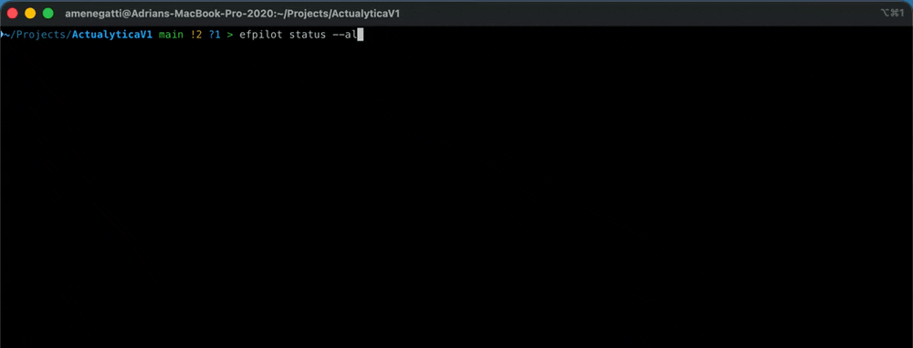
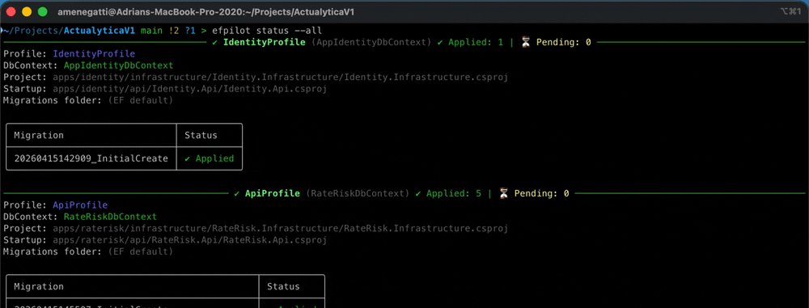

# EfPilot 🚀


Stop fighting `dotnet ef` in multi-project solutions.

EfPilot helps you **detect DbContexts, infer startup projects, avoid empty migrations, preview changes, and inspect migration status** — all with a clean, developer-friendly experience.

---

## 🎬 See EfPilot in Action

Manage migrations across multiple projects without `dotnet ef` command gymnastics.



---

## ✨ Features

* 🔍 **Auto-detect DbContexts**

    * Scans your solution and finds all DbContext classes

* 🧠 **Startup project inference**

    * Automatically determines the correct startup project for each DbContext

* 🚫 **Avoid empty migrations**

    * Detects and removes migrations with no model changes

* 🔎 **Migration diff preview**

    * See what will change before applying migrations

* 📊 **Migration status**

    * Shows applied vs pending migrations in a clean table

* 🎯 **Profiles**

    * Manage multiple DbContexts in a structured way

---

## 📦 Installation

Install EfPilot globally using the .NET tool system:

```bash
dotnet tool install -g efpilot
```

Verify the installation:

```bash
efpilot --version
```

---

## 🚀 Getting Started

### Initialize configuration

```bash
efpilot init
```

EfPilot will:

* detect your solution
* find DbContexts
* infer startup projects
* generate a config file

---

### Check migration status

```bash
efpilot status --all
```


Example output:

<details>
<summary>View sample output</summary>

```
──────────── MyProfile ── ✔ Applied: 5 | ⏳ Pending: 2 ────────────

Profile: MyProfile
DbContext: MyDbContext

┌───────────────────────────────────────────────┬────────────┐
│ Migration                                     │  Status    │
├───────────────────────────────────────────────┼────────────┤
│ 20260415145507_InitialCreate                  │ ✔ Applied  │
│ 20260416161708_AddImportRunsAndLoans          │ ✔ Applied  │
│ 20260420134851_AddCalculationWorkerEntities   │ ✔ Applied  │
│ 20260421155040_MovedParametersToImportRun     │ ✔ Applied  │
│ 20260428154005_UpdateCalculationJobs          │ ✔ Applied  │
│ 20260430120000_AddNewField                    │ ⏳ Pending │
└───────────────────────────────────────────────┴────────────┘
```
</details>
---

### Add a migration

```bash
efpilot add --profile MyProfile --name AddNewField
```

* Automatically uses correct startup project
* Removes migration if no changes detected

---

### Remove last migration

```bash
efpilot remove --profile MyProfile
```

---

### Update database

```bash
efpilot update --profile MyProfile
```

---

### Preview changes (diff)

```bash
efpilot diff --profile MyProfile
```


Example:

```
✔ Add column 'Code' to 'Loans'
✔ Create index 'IX_Loans_Code'
```

---

## ⚙️ Configuration

EfPilot generates a config file:

```json
{
  "version": 1,
  "solution": "MySolution.slnx",
  "profiles": [
    {
      "name": "MyProfile",
      "dbContext": "MyDbContext",
      "project": "apps/MyApp/infrastructure/MyApp.Infrastructure.csproj",
      "startupProject": "apps/myapp/api/MyApp.Api.csproj",
      "migrationsFolder": null
    }
  ]
}
```

---

## 🧩 Why EfPilot?

Working with EF Core migrations in multi-project solutions can be painful:

* ❌ You must remember startup project paths
* ❌ Empty migrations pollute your repo
* ❌ No easy way to preview changes
* ❌ Status visibility is limited

EfPilot solves all of this with a simple CLI.

---

## 🛠 Built with

* .NET 10
* Entity Framework Core
* Spectre.Console

---

## 📖 Background & Deep Dive
If you want to know the "why" and "how" behind EfPilot, I wrote a detailed technical breakdown on DEV Community:
👉 [How I Built a Smarter EF Core Migration CLI for Multi-Project Solutions](https://dev.to/amenegatti/how-i-built-a-smarter-ef-core-migration-cli-for-multi-project-solutions-4k1f)

---

## 💬 Community Feedback
EfPilot has sparked great interest in the developer community:
- **14,000+ views** on Reddit ([r/dotnet discussion](https://www.reddit.com/r/csharp/comments/1t4krn1/how_do_you_handle_ef_core_migrations_in/))
- Featured on **Dev.to**

---

## 📌 Roadmap & AI Integration
Based on community feedback, here’s what we’re building next:
- **Smart Diff Engine:** Using AI to explain complex migration changes in plain English.
- **Migration History Visualization:** Interactive timelines of your database schema evolution.
- **Interactive Mode:** A guided wizard for resolving migration conflicts.
---

## 🤝 Contributing

PRs and feedback are welcome!

---

## 📄 License

MIT
